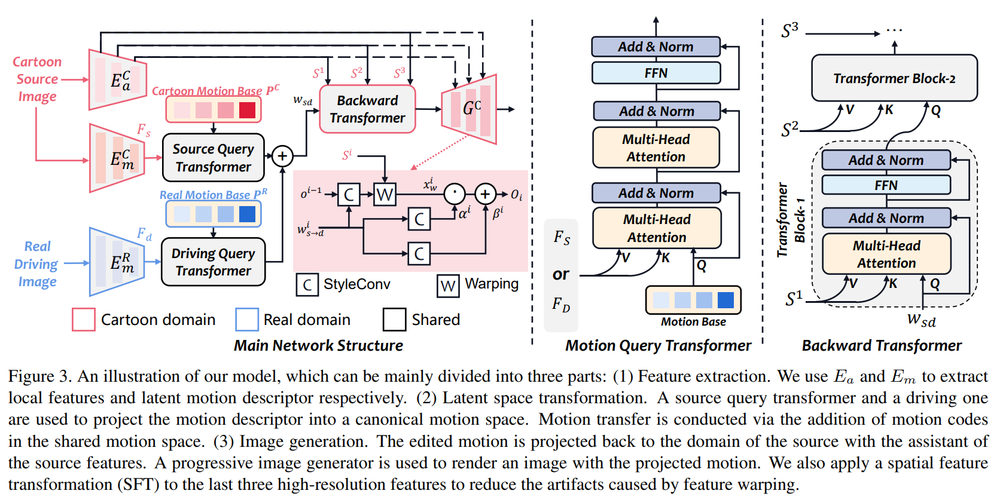

<div align="center">

<h2>ToonTalker: Cross-Domain Face Reenactment </h2> 

 <a href='https://arxiv.org/abs/2308.12866'></a> &nbsp;&nbsp;&nbsp;&nbsp;&nbsp;<a href='https://opentalker.github.io/ToonTalker/'></a> 
  
<!-- ## <b><font color="red"> TaleCrafter </font>: Interactive Story Visualization with Multiple Characters</b> -->

_**[Yuan Gong](https://github.com/yuanygong), [Yong Zhang*](https://yzhang2016.github.io/), [Xiaodong Cun](http://vinthony.github.io/), [Yin Fei](https://github.com/FeiiYin), Yanbo Fan, [Xuan Wang](https://xuanwangvc.github.io/),<br> [Baoyuan Wu](https://sds.cuhk.edu.cn/en/teacher/322), [Yujiu Yang*](https://sites.google.com/view/iigroup-thu/home)**_
  
(* Corresponding Authors)


https://user-images.githubusercontent.com/103869735/265267318-c3ba5d08-2732-4cad-afd5-be91ff64766e.mp4
 
<!-- <table class="center">
<td></td>
<td></td>
<td></td>
</table > -->

  </div>

## 🎏 Abstract
We target cross-domain face reenactment in this paper, i.e., driving a cartoon image with the video of a real person and vice versa. 
Recently, many works have focused on one-shot talking face generation to drive a portrait with a real video, i.e., within-domain reenactment. 
Straightforwardly applying those methods to cross-domain animation will cause inaccurate expression transfer, blur effects, and even apparent artifacts due to the domain shift between cartoon and real faces. 
Only a few works attempt to settle cross-domain face reenactment. 
The most related work AnimeCeleb requires constructing a dataset with pose vector and cartoon image pairs by animating 3D characters, which makes it inapplicable anymore if no paired data is available. 
In this paper, we propose a novel method for cross-domain reenactment without paired data. 
Specifically, we propose a transformer-based framework to align the motions from different domains into a common latent space where motion transfer is conducted via latent code addition. 
Two domain-specific motion encoders and two learnable motion base memories are used to capture domain properties. 
A source query transformer and a driving one are exploited to project domain-specific motion to the canonical space. 
The edited motion is projected back to the domain of the source with a transformer. 
Moreover, since no paired data is provided, we propose a novel cross-domain training scheme using data from two domains with the designed analogy constraint. 
Besides, we contribute a cartoon dataset in Disney style. 
Extensive evaluations demonstrate the superiority of our method over competing methods.

<!-- <details><summary>CLICK for the full abstract</summary> -->


> 
<!-- </details> -->
<!-- <p align="center">  </p> -->
  
## ⚔️ Overview

<p align="center">  </p>
<!-- <p align="center">  </p> -->

## Quick Start

#### Pretrained Models

You can manually download our [pre-trained model](https://drive.google.com/drive/folders/1k14D7JnZXOJMEMBkTIsy-WEV7qEb3rCs?usp=drive_link) and put it in ./checkpoints.

| Model | Description
| :--- | :----------
|checkpoints/in-domain440000.pth | Pre-trained ToonTalker Checkpoints for In-Domain Reenactment.
|checkpoints/cross-domain.pth | Pre-trained ToonTalker Checkpoints for Cross-Domain Reenactment.

#### Inference

+ In-Domain Reenactment with a single image and a video.
```
python run_demo_indomain.py \
 --source_path source.jpg \
 --driving_path input.mp4 \
 --output_dir output.mp4
```

+ Cross-Domain Reenactment with a single real-domain image and a cartoon-domain video.

```
python run_demo_crossdomain.py \
 --type c2r \
 --source_path source.jpg \
 --driving_path input.mp4 \
 --output_dir output.mp4
```

+ Cross-Domain Reenactment with a single cartoon-domain image and a real-domain video.

```
python run_demo_crossdomain.py \
 --type r2c \
 --source_path source.jpg \
 --driving_path input.mp4 \
 --output_dir output.mp4
```


## 🌰 More Examples
### Cross-domain Reenactment——real to cartoon
https://user-images.githubusercontent.com/103869735/265267306-5722cba9-690f-4554-bdf3-927eb9660b9e.mp4

https://user-images.githubusercontent.com/103869735/265267313-b8807b94-5e27-4469-b326-f2a88d19e1bb.mp4

### Cross-domain Reenactment——cartoon to real
https://user-images.githubusercontent.com/103869735/265267329-811705cf-f3d3-4fae-9977-28981766e77a.mp4

https://user-images.githubusercontent.com/103869735/265267324-3ffcda66-c36a-44c1-8d9a-3d1b4737d4db.mp4

### In-domain Cross-id Reenactment
https://user-images.githubusercontent.com/103869735/265267290-0796bfef-2baa-47bf-80a5-92bef01d992f.mp4

https://user-images.githubusercontent.com/103869735/265267300-6d4638ea-7007-4959-8ea3-55dcfb78b4de.mp4


## Citation
```bib
@misc{gong2023toontalker,
      title={ToonTalker: Cross-Domain Face Reenactment}, 
      author={Gong Yuan and Zhang Yong and Cun Xiaodong and Yin Fei and Fan Yanbo and Wang Xuan and Wu Baoyuan and Yang Yujiu},
      year={2023},
      eprint={2308.12866},
      archivePrefix={arXiv},
      primaryClass={cs.CV}
}
```
<div align="center">

<h2>ToonTalker: Cross-Domain Face Reenactment </h2> 

 <a href='https://arxiv.org/abs/2308.12866'></a> &nbsp;&nbsp;&nbsp;&nbsp;&nbsp;<a href='https://opentalker.github.io/ToonTalker/'></a> 
  
<!-- ## <b><font color="red"> TaleCrafter </font>: Interactive Story Visualization with Multiple Characters</b> -->

_**[Yuan Gong](https://github.com/yuanygong), [Yong Zhang*](https://yzhang2016.github.io/), [Xiaodong Cun](http://vinthony.github.io/), [Yin Fei](https://github.com/FeiiYin), Yanbo Fan, [Xuan Wang](https://xuanwangvc.github.io/),<br> [Baoyuan Wu](https://sds.cuhk.edu.cn/en/teacher/322), [Yujiu Yang*](https://sites.google.com/view/iigroup-thu/home)**_
  
(* Corresponding Authors)


https://user-images.githubusercontent.com/103869735/265267318-c3ba5d08-2732-4cad-afd5-be91ff64766e.mp4
 
<!-- <table class="center">
<td></td>
<td></td>
<td></td>
</table > -->

  </div>

## 🎏 Abstract
We target cross-domain face reenactment in this paper, i.e., driving a cartoon image with the video of a real person and vice versa. 
Recently, many works have focused on one-shot talking face generation to drive a portrait with a real video, i.e., within-domain reenactment. 
Straightforwardly applying those methods to cross-domain animation will cause inaccurate expression transfer, blur effects, and even apparent artifacts due to the domain shift between cartoon and real faces. 
Only a few works attempt to settle cross-domain face reenactment. 
The most related work AnimeCeleb requires constructing a dataset with pose vector and cartoon image pairs by animating 3D characters, which makes it inapplicable anymore if no paired data is available. 
In this paper, we propose a novel method for cross-domain reenactment without paired data. 
Specifically, we propose a transformer-based framework to align the motions from different domains into a common latent space where motion transfer is conducted via latent code addition. 
Two domain-specific motion encoders and two learnable motion base memories are used to capture domain properties. 
A source query transformer and a driving one are exploited to project domain-specific motion to the canonical space. 
The edited motion is projected back to the domain of the source with a transformer. 
Moreover, since no paired data is provided, we propose a novel cross-domain training scheme using data from two domains with the designed analogy constraint. 
Besides, we contribute a cartoon dataset in Disney style. 
Extensive evaluations demonstrate the superiority of our method over competing methods.

<!-- <details><summary>CLICK for the full abstract</summary> -->


> 
<!-- </details> -->
<!-- <p align="center">  </p> -->
  
## ⚔️ Overview

<p align="center">  </p>
<!-- <p align="center">  </p> -->

## Quick Start

#### Pretrained Models

You can manually download our [pre-trained model](https://drive.google.com/drive/folders/1k14D7JnZXOJMEMBkTIsy-WEV7qEb3rCs?usp=drive_link) and put it in ./checkpoints.

| Model | Description
| :--- | :----------
|checkpoints/in-domain440000.pth | Pre-trained ToonTalker Checkpoints for In-Domain Reenactment.
|checkpoints/cross-domain.pth | Pre-trained ToonTalker Checkpoints for Cross-Domain Reenactment.

#### Inference

+ In-Domain Reenactment with a single image and a video.
```
python run_demo_indomain.py \
 --source_path source.jpg \
 --driving_path input.mp4 \
 --output_dir output.mp4
```

+ Cross-Domain Reenactment with a single real-domain image and a cartoon-domain video.

```
python run_demo_crossdomain.py \
 --type c2r \
 --source_path source.jpg \
 --driving_path input.mp4 \
 --output_dir output.mp4
```

+ Cross-Domain Reenactment with a single cartoon-domain image and a real-domain video.

```
python run_demo_crossdomain.py \
 --type r2c \
 --source_path source.jpg \
 --driving_path input.mp4 \
 --output_dir output.mp4
```


## 🌰 More Examples
### Cross-domain Reenactment——real to cartoon
https://user-images.githubusercontent.com/103869735/265267306-5722cba9-690f-4554-bdf3-927eb9660b9e.mp4

https://user-images.githubusercontent.com/103869735/265267313-b8807b94-5e27-4469-b326-f2a88d19e1bb.mp4

### Cross-domain Reenactment——cartoon to real
https://user-images.githubusercontent.com/103869735/265267329-811705cf-f3d3-4fae-9977-28981766e77a.mp4

https://user-images.githubusercontent.com/103869735/265267324-3ffcda66-c36a-44c1-8d9a-3d1b4737d4db.mp4

### In-domain Cross-id Reenactment
https://user-images.githubusercontent.com/103869735/265267290-0796bfef-2baa-47bf-80a5-92bef01d992f.mp4

https://user-images.githubusercontent.com/103869735/265267300-6d4638ea-7007-4959-8ea3-55dcfb78b4de.mp4


## Citation
```bib
@misc{gong2023toontalker,
      title={ToonTalker: Cross-Domain Face Reenactment}, 
      author={Gong Yuan and Zhang Yong and Cun Xiaodong and Yin Fei and Fan Yanbo and Wang Xuan and Wu Baoyuan and Yang Yujiu},
      year={2023},
      eprint={2308.12866},
      archivePrefix={arXiv},
      primaryClass={cs.CV}
}
```
